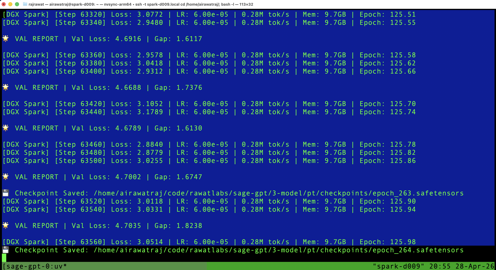
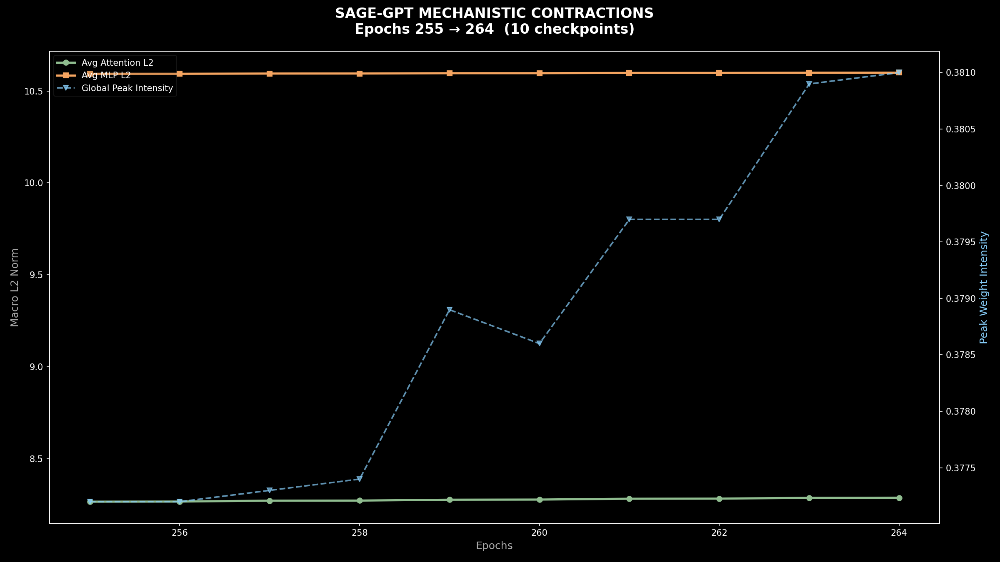
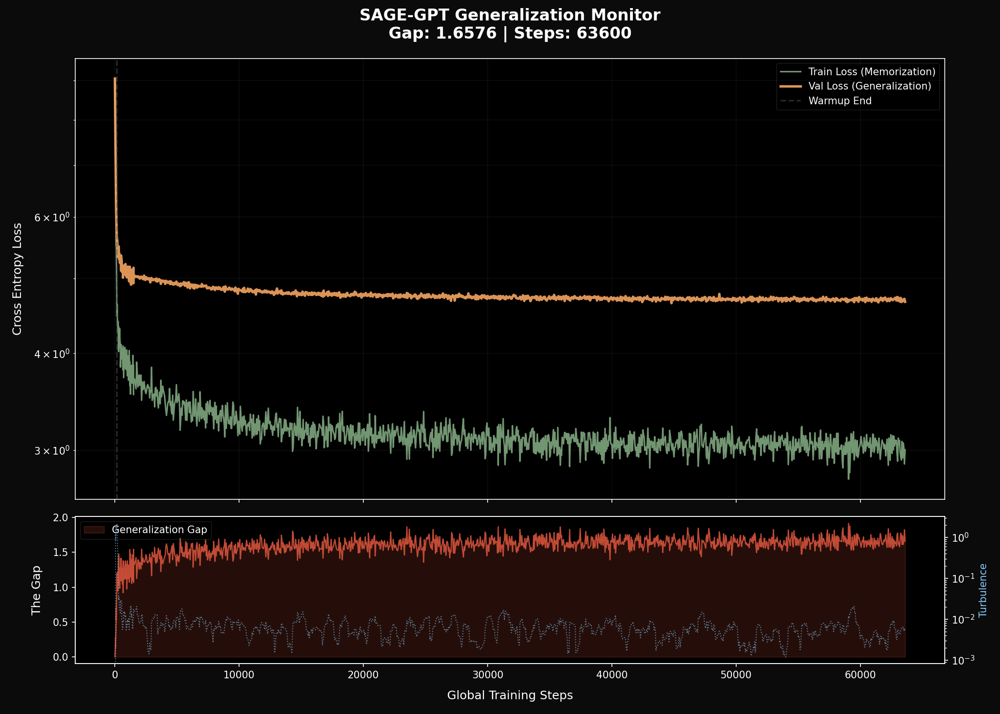

# 🕉️ Sovereign Ancient General Intelligence (SAGE-GPT)

> "To find the Sutra in the Signal."

**Sage-GPT-7.5M-Sutra (NVIDIA DGX)** is a Decoder-only Transformer trained from scratch on a specialized corpus of **~140M ultra-pure Sanskrit tokens** (225M characters). This model is a highly efficient Small Language Model (SLM) architected to balance parameter count with our 132.7M token corpus to prevent catastrophic overfitting while maximizing generalization and logic derivation.

## 🚀 DGX Specification Engine

| Feature | Specification | Impact |
| :--- | :--- | :--- |
| **Model Size** | **~7.5M Parameters** | Right-sized for the 132.7M token dataset to prevent overfitting. |
| **Architecture** | 6 Layers, 8 Attention Heads | Streamlined capacity for hierarchical language rules. |
| **Dimensions** | 256 Embedding Dim | Efficient semantic mapping of philosophical concepts. |
| **Context Window** | **1024 Tokens** | Ability to ingest full chapters/shlokas in one window. |
| **Tokenizer** | SentencePiece Unigram (8k Vocab) | Reduced fragmentation; captures complex *Sandhi*. |
| **Optimizations** | Weight Tying | Shared input/output embeddings to save parameters and stabilize Softmax. |
| **Precision** | `bfloat16` Native Mixed | Leverages DGX H100/A100 hardware for stable throughput. |

---

## 🚦 Execution Pipeline

### Step 1: Deep Data Purification (V5)
The **Visuddhi V5** engine transforms ~14GB of raw "soup" into a purified Sanskrit gold-standard corpus.
* **Lazy OCR Fallback**: Automatically triggers Tesseract OCR for scanned manuscripts while maintaining fast extraction for searchable PDFs.
* **Nukta & Hindi Shield**: 100% rejection of modern vernacular markers and "Decompression Bomb" safety for high-res 100MP manuscript scans.
```bash
uv run python3 1-data/05-scripts/visuddhiv5.py
```

### Step 2: Refine Corpus (Linguistic Scalpel)
Precision filtering for medieval vernacular (Awadhi/Brij) markers (ends in `हि`, `उ`) to ensure Sutra-grade purity.
```bash
uv run python3 1-data/05-scripts/refine_corpus.py
```

### Step 3: Sutra Tokenization (16k)
Builds the unigram model using an **8,192-word vocabulary** optimized for the ~139M token corpus.
```bash
uv run python3 2-tokenizer/sutra_tokenizer.py
```

### Step 4: High-Throughput DGX Training
Initiates the training loop optimized for the DGX Spark cluster. Features `torch.compile` graph optimization, FlashAttention, and Cosine Learning Rate Decay.
```bash
# Launch on NVIDIA DGX (128GB+ VRAM)
source .venv/bin/activate
uv run python3 train_dgx.py
```


---

## 🛡️ Linguistic Guardrails (V5)
Our "Zero-Poison" policy ensures the model trains only on high-fidelity Sanskrit.

| Guardrail | Implementation | Goal |
| :--- | :--- | :--- |
| **Normalization** | **NFKC Strict** | Prevents shattering of complex conjuncts/ligatures. |
| **Linguistic Isolation** | Disjoint Stopwords | Rejection of Hindi, Marathi, Pali, and Prakrit. |
| **Precision OCR** | san+hin Tesseract | Accurate recovery of scanned Sanskrit manuscripts. |
| **Vedic Integrity** | Swara Protection | Preserves Anusvara, Visarga, and Vedic accents. |

---

## 📊 Evaluation & Mechanistic Suite

Sage-GPT includes a suite of mechanistic interpretability tools to monitor the **Grokking Phase Shift**.
All scripts share a common foundation via **`eval_utils.py`** (model architecture, checkpoint resolution,
safe weight-tied loading) — no duplication across tools.

### Shared Foundation

| Module | Role |
| :--- | :--- |
| `eval_utils.py` | SageGPT eval model, `get_target_checkpoint()`, `load_model_from_checkpoint()` |

### Evaluation Tools

1. **Checkpoint Probe** — architecture shape + NaN/Inf health check before anything else.
   ```bash
   uv run python3 4-evaluation/sutra_probe_pt.py
   ```

2. **Norm History Builder** — scans all `epoch_*.safetensors`, accumulates L2 norms to CSV,
   and renders `norm_history.png`. Replaces the old two-step `inspect_norms + plot_norms` pipeline.
   No pandas required.
   ```bash
   uv run python3 4-evaluation/build_norm_history.py          # full scan + plot
   uv run python3 4-evaluation/build_norm_history.py --plot-only  # re-plot existing CSV
   ```
   
3. **Generalisation Gap Monitor** — plots Train vs. Val loss divergence and detects grokking phase shifts.
   ```bash
   uv run python3 4-evaluation/generalisation_gap_monitor.py
   ```
   

4. **The Ashtavakra Audit** — 8-bend Sanskrit generative consistency test (V2.3).
   ```bash
   uv run python3 4-evaluation/ashtavakra_audit.py
   ```

> **Tip:** Run the full pipeline (probe → norms → gap → audit → inference) with a single command:
> ```bash
> bash 4-evaluation/evaluate.sh
> ```

---

### Utility Commands

**Prune Checkpoints (Storage Optimization):**
```bash
uv run python3 3-training/src/prune_checkpoints.py
```

**Multi-Mode Inference (DGX Shell):**
```bash
uv run python3 inference.py
```

---
> 🕉️ Om Tat Sat (ॐ तत् सत्) - The Absolute is Truth