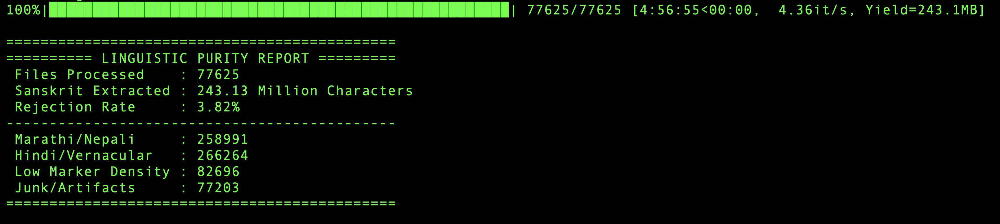
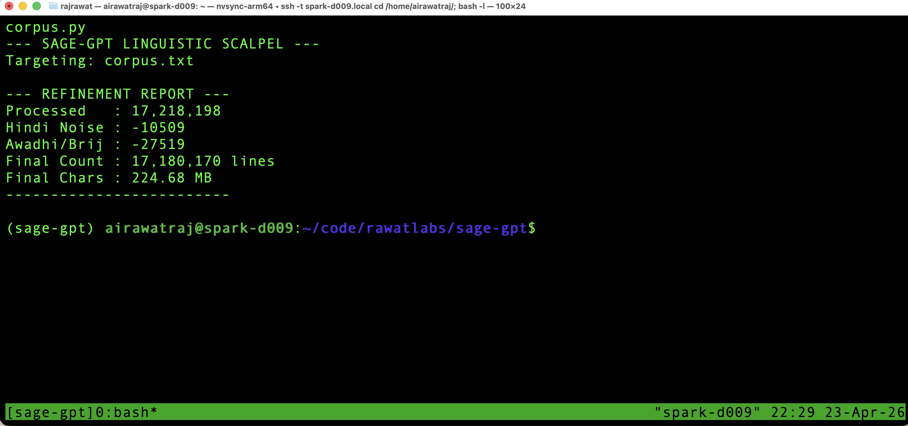
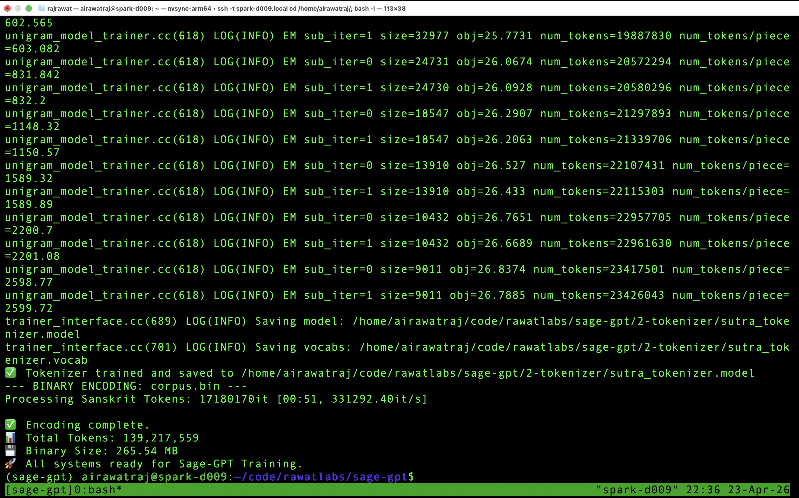
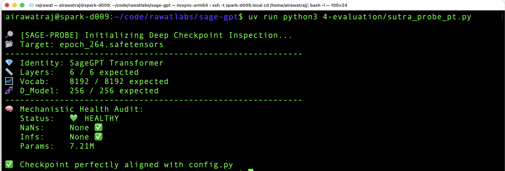
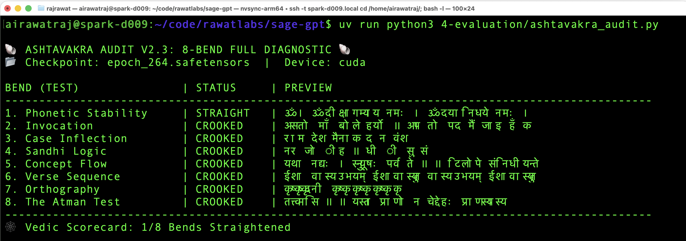

# 🕉️ SageGPT — Sanskrit Small Language Model (SLM)

> *"To find the Sutra in the Signal."*

**Sage-GPT** is a Sanskrit-only Small Language Model (SLM) trained **entirely from scratch** on a specialised corpus of **~140M ultra-pure Sanskrit tokens** (225M characters). It is not a fine-tuned version of an existing LLM — it is built ground-up, specifically for one language and one domain: classical and Vedic Sanskrit literature.

Sanskrit is structurally unlike modern languages. It has complex *sandhi* (phonological fusion rules), rich case inflection across 8 cases, strict metrical structure in verse, and a philosophical vocabulary that does not map into English-centric model spaces. General-purpose LLMs handle Sanskrit poorly. 

---

## 🏛️ Architecture

A **~7.5M parameter decoder-only Transformer**, right-sized relative to the corpus to prevent catastrophic overfitting while maximising generalisation.

| Component | Choice | Rationale |
| :--- | :--- | :--- |
| **Parameters** | ~7.5M | Right-sized for 132.7M tokens — prevents memorisation, forces generalisation |
| **Depth** | 6 Layers, 8 Attention Heads | Hierarchical capacity for Sanskrit morphological rules |
| **Dimensions** | 256 Embedding Dim | Efficient semantic mapping of philosophical concepts |
| **Context Window** | 1024 Tokens | Ingests full *shlokas* and chapters in a single pass |
| **Feed-Forward** | **SwiGLU** | Gated activation (Swish × Gate) — smoother loss surface, used by LLaMA-class models |
| **Positional Encoding** | **RoPE** | Rotary embeddings — relative position awareness, no learned position table |
| **Normalisation** | **RMSNorm** | Faster than LayerNorm; no mean-centering |
| **Weight Tying** | `output.weight = tok_emb.weight` | Shared input/output embeddings — reduces parameters, stabilises Softmax |
| **Tokenizer** | SentencePiece Unigram, 8,192 vocab | Reduces *sandhi* fragmentation vs BPE; keeps compound words intact |
| **Precision** | `bfloat16` via `torch.autocast` | Leverages DGX Spark (GB10) hardware; stable dynamic range |

---

## 🚦 Execution Pipeline

### Step 1 — Deep Data Purification (Visuddhi V5)

The **Visuddhi V5** engine transforms ~14GB of raw manuscript sources into a purified Sanskrit gold-standard corpus under a **"Zero-Poison" policy** — zero tolerance for vernacular contamination.

- **Lazy OCR Fallback** — Tesseract (`san+hin`) for scanned manuscripts; fast extraction for searchable PDFs
- **Nukta & Hindi Shield** — 100% rejection of Hindi, Marathi, Pali, and Prakrit markers
- **Decompression Bomb Safety** — handles high-resolution 100MP manuscript scans
- **NFKC Strict Normalisation** — prevents shattering of Devanagari conjuncts and ligatures
- **Swara Protection** — preserves Anusvara, Visarga, and Vedic accent markers

```bash
uv run python3 1-data/05-scripts/visuddhiv5.py
```



### Step 2 — Refine Corpus (Linguistic Scalpel)

Precision filtering for medieval vernacular (Awadhi/Brij) markers. Sentences ending with `हि` or `उ` patterns are flagged and removed to ensure Sutra-grade purity.

```bash
uv run python3 1-data/05-scripts/refine_corpus.py
```



### Step 3 — Sutra Tokenization

Trains a SentencePiece unigram model with an **8,192-word vocabulary** on the ~139M token Sanskrit corpus.

```bash
uv run python3 2-tokenizer/sutra_tokenizer.py
```



### Step 4 — DGX Training

`train_dgx.py` is the entry point — it launches `3-training/src/train_engine_dgx.py`, which runs the full training loop with `torch.compile` graph optimisation, fused SDPA (FlashAttention), cosine LR decay, gradient accumulation, thermal throttling, and auto-resume from any checkpoint.

```bash
uv run python3 train_dgx.py
```


---

## 🔥 Training Configuration

| Hyperparameter | Value | Purpose |
| :--- | :--- | :--- |
| **Optimizer** | AdamW (β₁=0.9, β₂=0.95) | Standard for transformers |
| **Learning Rate** | 2e-4 → 6e-5 (cosine) | Warmup 150 steps, decays over 1,500 |
| **Weight Decay** | 0.05 | L2 regularisation on weight matrices only |
| **Dropout** | 0.1 (config.py) | Applied to embeddings, attention, and MLP residuals |
| **Label Smoothing** | 0.1 | Softens cross-entropy; prevents overconfident wrong predictions |
| **Gradient Clipping** | 1.0 | Prevents gradient explosion |
| **Batch Size** | 256 (global) / 64 (micro) | 4-step gradient accumulation |
| **Training Duration** | Indefinite (`MAX_STEPS = None`) | Ctrl+C triggers emergency save and clean exit |
| **Thermal Guard** | Pause at 75°C | Home DGX Spark thermal safety |

### Grokking Strategy

Training is configured to **resist memorisation and force generalisation** — the phenomenon called **grokking**, where a model initially overfits, then phase-shifts into true rule-based generalisation. The signal is the **generalisation gap closing**: validation loss converging toward training loss after a sustained period of divergence. The training engine fires a `🚨 PHASE SHIFT DETECTED` alert when validation loss drops below 2.5.

---

## 🛡️ Linguistic Guardrails

| Guardrail | Implementation | Goal |
| :--- | :--- | :--- |
| **Normalisation** | NFKC Strict | Prevents shattering of complex conjuncts/ligatures |
| **Linguistic Isolation** | Disjoint stopword rejection | Removes Hindi, Marathi, Pali, Prakrit |
| **Precision OCR** | Tesseract `san+hin` | Accurate recovery of scanned Sanskrit manuscripts |
| **Vedic Integrity** | Swara Protection | Preserves Anusvara, Visarga, and Vedic accents |

---

## 📊 Evaluation & Mechanistic Suite

All evaluation scripts share a common foundation — `eval_utils.py` — which centralises the model architecture, checkpoint resolution, and weight-tied loading logic.

| Shared Module | Role |
| :--- | :--- |
| `eval_utils.py` | SageGPT eval-mode model, `get_target_checkpoint()`, `load_model_from_checkpoint()` |

### 1. Checkpoint Probe

Architecture shape validation and NaN/Inf health check. Run this first.

```bash
uv run python3 4-evaluation/sutra_probe_pt.py
```



### 2. Weight Norm History

Scans all `epoch_*.safetensors` checkpoints, computes L2 norms of Attention and MLP weight matrices, accumulates to CSV, and renders `norm_history.png`. Tracks **weight consolidation** — the mechanistic signature of grokking.

```bash
uv run python3 4-evaluation/build_norm_history.py            # full scan + plot
uv run python3 4-evaluation/build_norm_history.py --plot-only    # re-plot existing CSV
```


### 3. Generalisation Gap Monitor

Plots Train vs. Validation loss on a log scale with a secondary panel for the gap and loss turbulence (rolling variance). Fires a **🔥 PHASE TRANSITION ALERT** when validation loss drops >5% relative to its recent average.

```bash
uv run python3 4-evaluation/generalisation_gap_monitor.py
```


### 4. The Ashtavakra Audit

An 8-bend Sanskrit generative consistency test, named after the sage Ashtavakra (8 physical bends). Each bend is a Sanskrit prompt tested against an expected token in the completion — **STRAIGHT** if present, **CROOKED** if not.

| Bend | Prompt | Expected | Tests |
| :--- | :--- | :--- | :--- |
| 1. Phonetic Stability | `ॐ` | `नमः` | Basic phoneme chaining |
| 2. Invocation | `असतो मा` | `सद्गमय` | Brhadaranyaka Upanishad mantra |
| 3. Case Inflection | `राम` | `ः` | Nominative *visarga* suffix |
| 4. Sandhi Logic | `नर` | `इन्द्र` | Compound word formation |
| 5. Concept Flow | `यथा नद्यः` | `समुद्रे` | River-to-ocean Upanishad metaphor |
| 6. Verse Sequence | `ईशा वास्य` | `सर्वं` | Ishavasyopanishad opening |
| 7. Orthography | `कृष्` | `ण` | Conjunct completion |
| 8. The Atman Test | `तत्त्वमसि` | `श्वेतकेतो` | Chandogya Upanishad dialogue |

```bash
uv run python3 4-evaluation/ashtavakra_audit.py
```



### Run Full Pipeline

```bash
bash 4-evaluation/evaluate.sh
```

Executes in order: **Probe → Norms → Gap → Audit → Inference** (10 Sanskrit prompts piped through the inference engine).

---

## 🕉️ Inference

`inference.py` is the entry point — it validates CUDA availability and launches `5-inference/inference_engine_pt.py`, which uses a KV-cache for autoregressive generation, top-p sampling with repetition penalty, and `bfloat16` autocast.

```bash
uv run python3 inference.py
```

---

## 🔧 Utilities

**Prune old checkpoints (keeps latest 10):**
```bash
uv run python3 3-training/src/prune_checkpoints.py
```

---

> 🕉️ *Om Tat Sat* (ॐ तत् सत्) — The Absolute is Truth